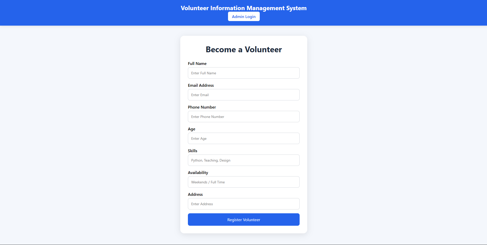
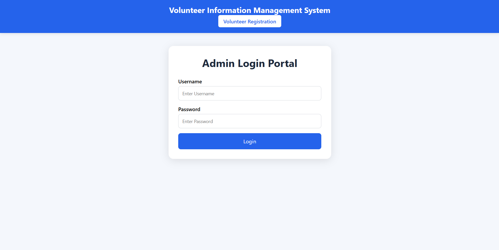
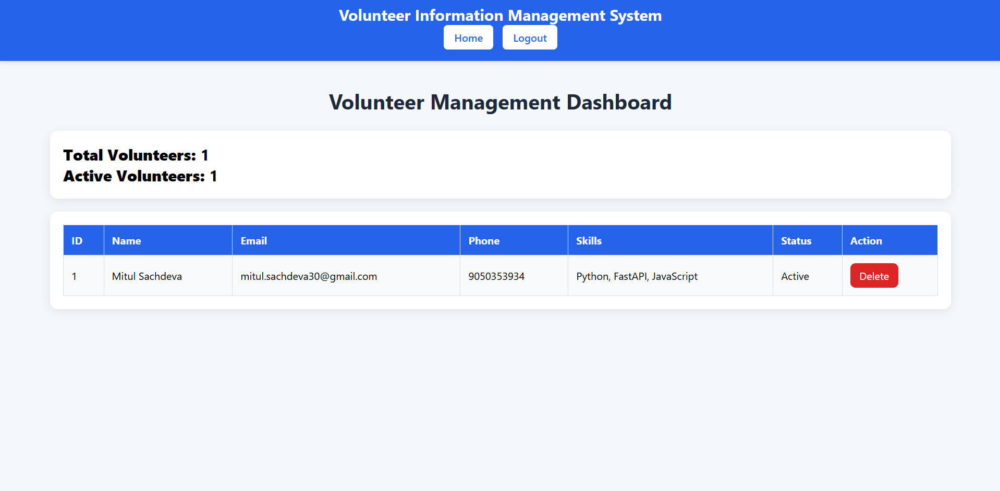

# Volunteer Information Management System

## Features

- Volunteer Registration
- Admin Login
- Volunteer Dashboard
- Volunteer Management
- SQLite Database
- REST APIs
- Statistics Dashboard

## Screenshots

### Registration Page



### Admin Login



### Dashboard



## Tech Stack

- FastAPI
- SQLAlchemy
- SQLite
- HTML
- CSS
- JavaScript

## Run Backend

```bash
pip install -r requirements.txt
uvicorn app.main:app --reload
```

## API Documentation

http://127.0.0.1:8000/docs